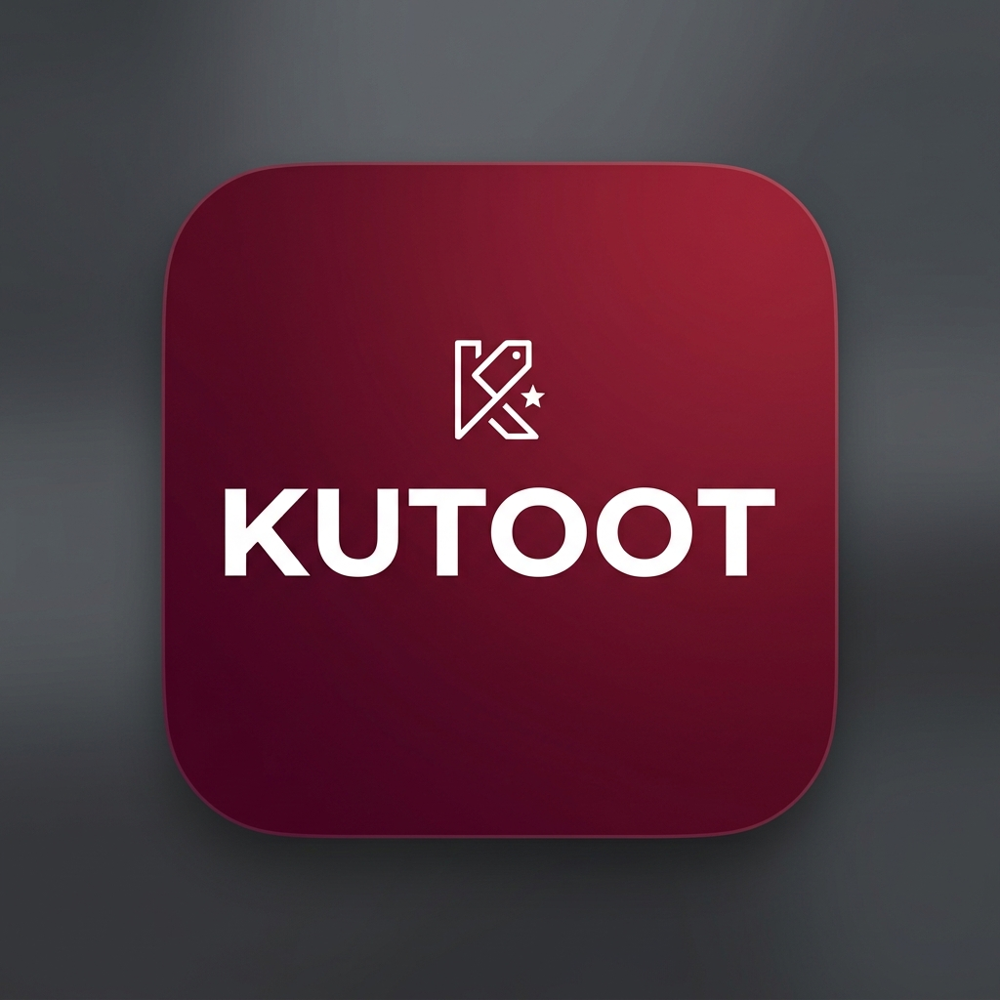

# Kutoot — Shopping & Rewards Platform

<p align="center">
  
</p>

<p align="center">
  <b>Shop. Earn. Repeat.</b><br/>
  A feature-rich Flutter shopping & rewards app built with clean architecture and optimized for production.
</p>

<p align="center">
  
  
  
  
  
</p>

---

## What is Kutoot?

Kutoot is a shopping & rewards platform where users can discover nearby stores, browse categories, track reward challenges, choose membership plans, and manage their profiles — all within a seamless, fast native experience.

I built this as a complete end-to-end Flutter project focusing on **performance**, **clean architecture**, and a **polished UI** that feels production-ready.

---

## Screenshots & Screens

The app has **7 functional screens** connected through a bottom navigation shell:

| Splash | Home | Stores |
|--------|------|--------|
| Animated brand intro with fade-in + scale | Location, search, banner, categories, nearby stores, rewards preview | Category filters, search, 2-column grid with curated store cards |

| Rewards | Plans | Profile |
|---------|-------|---------|
| Horizontal reward cards with progress tracking | 3-tier membership plans (Plus, Gold, Platinum) | Gradient header, stats, menu sections, editable profile |

---

## Tech Stack

| Layer | Tech | Why |
|-------|------|-----|
| **Framework** | Flutter 3.11+ | Cross-platform, single codebase |
| **State Management** | Riverpod | Compile-safe, fine-grained reactivity, no boilerplate |
| **Local DB / Cache** | Hive | Lightweight NoSQL, instant reads after first load |
| **Persistence** | SharedPreferences | Simple key-value storage for user profile |
| **Fonts** | Google Fonts (Inter, Oswald, Great Vibes) | Custom typography without bundling font files |
| **Architecture** | Feature-First Clean Arch | Modular, scalable, easy to navigate |

---

## Architecture

```
lib/
├── main.dart
├── core/
│   ├── constants/         # Colors, dimensions, strings
│   ├── providers/         # Global Riverpod providers
│   ├── theme/             # Material3 theme config
│   └── widgets/           # Shared reusable widgets
├── data/
│   ├── models/            # CategoryModel, StoreModel, RewardModel, PlanModel
│   └── repositories/      # DataRepository (JSON + Hive + Isolate)
└── features/
    ├── splash/            # Animated splash screen
    ├── shell/             # Bottom nav + IndexedStack
    ├── home/              # Dashboard (banner, categories, stores, rewards)
    ├── search/            # Search (integrated into Home & Stores)
    ├── rewards/           # Reward challenge cards
    ├── stores/            # Store grid + category filters
    ├── plans/             # Membership plan selection
    └── profile/           # User account + settings
```

Each feature is self-contained under `features/` — no cross-feature imports, keeping things modular.

---

## Key Features

### 🏠 Home Dashboard
- Location pill with city selector UI
- Real-time search that filters nearby stores as you type
- Promotional banner with layered typography (Oswald + Great Vibes)
- Horizontal category row with color-coded icons
- Nearby stores in 2-row horizontal scroll with discount badges, ratings, and "Pay Bill" CTAs
- Weekly rewards preview with background images, gradient overlays, and segmented progress bars

### 🏬 Store Discovery
- Category chip filters (All, Fashion, Food, Electronics, etc.)
- Combined search + category filtering via derived Riverpod provider
- 2-column responsive grid layout
- Each card shows: store image, flat discount badge, star rating, distance, and action buttons

### 🎁 Rewards
- Horizontal scrollable reward cards
- Each card has a background image with gradient fade
- Progress tracked via segmented bar (8 segments) with percentage
- Status pills (PRIMARY / ELIGIBLE) on each card

### 💳 Membership Plans
- 3 plans: Plus (₹299/mo), Gold (₹999/6mo), Platinum (₹1499/yr)
- Gradient cards generated from JSON color values
- Feature checklists, pricing, and "Most Popular" badge
- "Select Plan" CTA on each card

### 👤 Profile & Account
- Gradient header with avatar and Gold Member badge
- Stats row: Points (2,450), Orders (18), Saved (₹12.5K)
- Grouped menu sections: My Account, Activity, Settings
- Edit profile dialog — saves to SharedPreferences, updates UI in real-time
- Logout button and version display

---

## Performance Optimizations

This isn't just a UI demo — I spent time making sure it runs smooth:

| Optimization | What it Does |
|-------------|--------------|
| **Isolate-based JSON parsing** | `Isolate.run()` offloads JSON decoding to a background thread so the UI thread never blocks |
| **Hive caching** | First load parses JSON → caches to Hive. All subsequent reads are instant from disk |
| **RepaintBoundary** | Wrapped around every store card, reward card, plan card, and banner to prevent unnecessary repaints during scroll |
| **Image cacheWidth** | Network images decoded at 300px/600px width instead of full resolution — saves ~60-70% memory |
| **IndexedStack** | All 5 tabs stay alive in memory — tab switches are instant, scroll positions preserved |
| **Computed providers** | `filteredStoresProvider` is a derived provider — only recomputes when search query or category actually changes |
| **const constructors** | Used everywhere possible to let Flutter skip rebuild checks |
| **Error boundaries** | Every network image has `errorBuilder` fallback so broken URLs don't crash the UI |

---

## Data

All data is loaded from local JSON files under `assets/data/`:

| File | Records | Content |
|------|---------|---------|
| `categories.json` | 8 | Fashion, Food, Grocery, Electronics, Beauty, Sports, Cafe, Health |
| `stores.json` | 24 | Real brand names (Zara, H&M, Nike, Apple, Starbucks, etc.) with Unsplash images |
| `rewards.json` | 5 | Reward challenges with progress tracking |
| `plans.json` | 3 | Membership tiers with features and pricing |

---

## State Management Flow

```
User types in search bar
    │
    ▼
searchQueryProvider updates
    │
    ▼
filteredStoresProvider recomputes (watches searchQuery + selectedCategory)
    │
    ▼
Only the store list widget rebuilds — rest of the screen stays untouched
```

```
User taps category chip on Stores screen
    │
    ▼
selectedCategoryProvider updates
    │
    ▼
filteredStoresProvider recomputes
    │
    ▼
Grid view rebuilds with filtered results + "X STORES FOUND" counter updates
```

---

## Getting Started

### Prerequisites
- Flutter SDK 3.11+ installed
- Android Studio / VS Code with Flutter extension
- An emulator or physical device

### Run locally
```bash
git clone https://github.com/ankitraaz/putout_assignment.git
cd kuttot
flutter pub get
flutter run
```

### Build release APK
```bash
# Split per ABI for smaller APK sizes
flutter build apk --release --split-per-abi
```

This generates 3 optimized APKs:
- `app-armeabi-v7a-release.apk` — older ARM devices
- `app-arm64-v8a-release.apk` — modern phones (most common)
- `app-x86_64-release.apk` — emulators

### Install on connected device
```bash
flutter install
```

---

## Navigation Map

```
App Launch → Splash (2.5s animated)
    │
    ▼
Bottom Nav Shell (IndexedStack)
    ├── Home
    │   ├── Search bar → filters nearby stores
    │   ├── "SEE ALL" stores → jumps to Stores tab
    │   ├── "SEE ALL" rewards → jumps to Rewards tab
    │   └── "UPGRADE" → jumps to Plans tab
    ├── Rewards → full reward card listing
    ├── Stores → search + filter + grid
    ├── Plans → membership selection
    └── Profile → account management + edit dialog
```

---

## What I'd Add Next

- [ ] Backend API integration (replace local JSON)
- [ ] QR code scanner functionality (FAB is already placed)
- [ ] Push notifications for reward expiry
- [ ] Dark mode theme toggle
- [ ] Payment gateway integration for plans
- [ ] Store detail page with reviews
- [ ] Location-based store sorting (GPS)

---

## License

This project was built as an assignment submission. Feel free to reference the architecture and patterns.

---

<p align="center">
  Built with Flutter 💙
</p>
